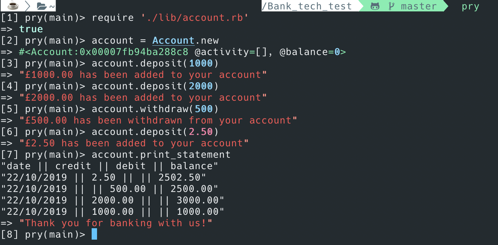

# Bank - Tech Test

## Specification

### Requirements

- You should be able to interact with your code via a REPL like IRB or the JavaScript console. (You don't need to implement a command line interface that takes input from STDIN.)
- Deposits, withdrawal.
- Account statement (date, amount, balance) printing.
- Data can be kept in memory (it doesn't need to be stored to a database or anything).

### Acceptance criteria
**Given** a client makes a deposit of 1000 on 10-01-2010.  
**And** a deposit of 2000 on 13-01-2012.  
**And** a withdrawal of 500 on 14-01-2012.  
**When** she prints her bank statement.  
**Then** she would see.  
```
date || credit || debit || balance
14/01/2012 || || 500.00 || 2500.00
13/01/2012 || 2000.00 || || 3000.00
10/01/2012 || 1000.00 || || 1000.00
```

## Installation

- fork and clone this repo  
- navigate into the working directory from the command line:  
``` $ cd Bank_tech_test ```
- open PRY or IRB  
``` $ pry ``` / ``` $ irb ```
- require the account file within your chose REPL  
``` > require "./lib/account.rb" ```
- ENJOY

#### Example Usage

#### Test Suit
  

#### Considerations for edge cases
> Users can currently become overdrawn by an infinite amount perhaps limit to 2000?  
---
